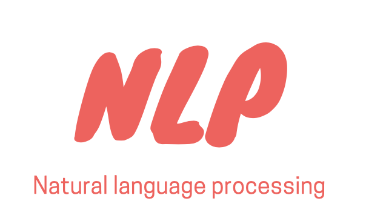

# NLP Best Practices

In recent years, natural language processing (NLP) has seen quick growth in quality and usability, and this has helped to drive business adoption of artificial intelligence (AI) solutions. In the last few years, researchers have been applying newer deep learning methods to NLP. Data scientists started moving from traditional methods to state-of-the-art (SOTA) deep neural network (DNN) algorithms which use language models pretrained on large text corpora.
